# sei-group-project-3 #

# RoadTrippers

## https://roadtrippers-ga-project.herokuapp.com/
Log in to experience the full functionality of the site:

email: assia@email

password: pass

Please note; as Heroku puts websites to sleep when inactive for a prolonged period of time, it may take up to 20 seconds to load the site the first time.

## Overview

Working in a group this was our first time putting together a full stack app. We brainstormed and pooled our ideas, brainstorming aloud, picking out parts of ideas we liked until something was unintentionally born that everyone had contributed to. No one person thought of it, yet we all have a share of it.
We then worked together to create a wireframe using balsamiq.com
Roadtrippers is a community based travel app specifically for road routes.
Working on both back and front end of development, it was captivating to see how to bring both those ends together, and I thoroughly enjoyed my first experience in full stack development.

----------------

## Project Brief:
- Build a full-stack application** by making your own backend and your own front-end.
- Use an Express API** to serve your data from a Mongo database.
- Consume your API with a separate front-end** built with React.
- Be a complete product** which most likely means multiple relationships and CRUD functionality for at least a couple of models.
-Implement thoughtful user stories/wireframes** that are significant enough to help you know which features are core MVP and which you can cut.
-Have a visually impressive design** to kick your portfolio up a notch and have something to wow future clients & employers.
- Be deployed online so it's publicly accessible.

--------------

# Code Installation
- Clone or download the repo
- Install Yarn in terminal with command: yarn
- Start server with terminal command: yarn start

--------------

## Technologies used
# Backend:
- Node.js
- MongoDB
- Mongoose
- Mongoose-unique-validator
- Body-parser
- Express
- jsonwebtoken
- Bcrypt

# Frontend:
- React
- SCSS
- Http-proxy-middleware
- Axios
- Node-sass
- React-burger-menu
- React-router-dom
- React-dom
- React-map-gl
- React-modal
- React-responsive-carousel
- React-select
- React-tooltip

# Development Tools:
- VS Code Editor
- GitHub
- Git
- Insomnia
- Balsamiq.com
- Chrome Dev Tools
- Heroku

-----------------
## Approach
As there was 3 of us, we decided 1 person shall start scaffolding out the front to prepare to receive the backend while me and my colleague kitted out the backend using Mongoose to create our database. We kept communication between the 3 of us open and accessible to make sure our work would sync in harmony. Starting to work at the same time everyday together we would stay a zoom room during work hours and work out breaks as and when on a daily basis. This meant we were all on call to one another during the day while getting on with our own pieces. This was especially important when our piece would coincide or effect another’s piece.

We first started with Balsamiq to get our wireframes down and all understanding and in agreement with the specification. Upon agreement of the MVP and the 'nice-to-haves' we marked down approximately what build mile-stones we wanted to hit during the week. For e.g. having the models/relationships and controllers done by day x and also leaving x days before the deadline for finishing touches and styling.

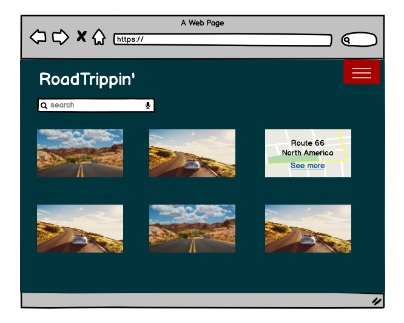

# Backend
*Models:*

My colleague and I worked together on the backend talking through and making initial notes on what models we needed, the necessary fields and how we were going to set those fields; string field for example or object or even a virtual field.

- We created 3 main schemas using Mongoose, also taking advantage of Mongoose's ability to create virtual fields which we used to create a password confirmation field to validate the users password upon registration.

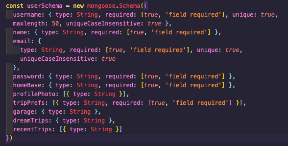

 Using Bcrypt we pre-validated password comparisons, if this passed we then hashed them before they were saved to protect the users password.

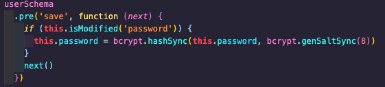

 Following this we edited the JSON response to stop the email and password being sent back in the response to the client.
- Besides our 3 main schemas we used schemas to be used in some fields of our main schemas:
- Our Message schema; aside from the sender and recipient field, has a comment field which is made up of an array of Comment schemas. Our comment schema has 2 fields; User and Text.

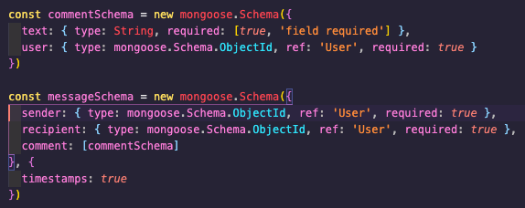

- Our Trip schema; had a field for recommendation field which was an array of recommendation schemas. Very similar to our message and comment.

*Controllers:*
- We had 3 controllers; Users, Trips, Auth.
Initially we built our basic CRUD requests on Users and Auth. We used jsonwebtoken to create tokens upon login which we later used to create secure and authorised only functions of our app.

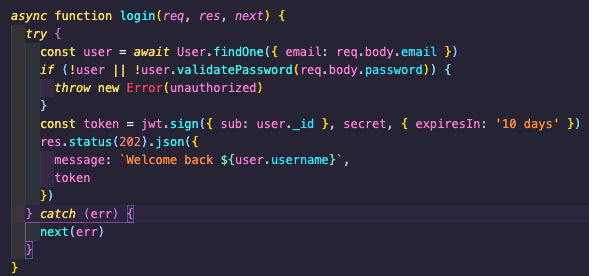
We also set a secret in which we hashed the token with ourselves. We hid this in an environment file and then imported it in.
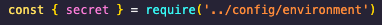

- We tested all our end point using Insomnia to ascertain we were retrieving the correct data, also that our secure routes were protecting and blocking unwanted users from accessing certain data when the correct token was not provided.

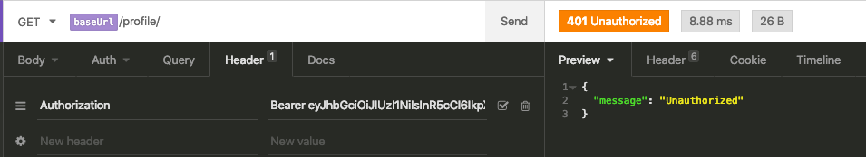
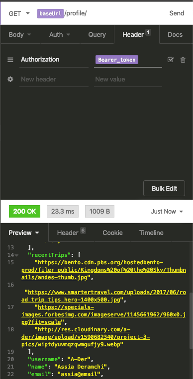

- We also created specific error handlers to improve our json responses on the front end which greatly helped our development process.

# Frontend:
Coming to the front end was a great first moment of real life web development. Where our colleague had been working, I was coming face to face with unknown code in the front end and they vice versa. It was a moment of truth as we were to see what our 2 months of study had taught us as we tested bringing the 2 ends together and what was to happen. 
It was a smooth process, thanks to our team dynamic of open and accessible communication, super respectful of touching each other’s code and great technical communication. 
We then worked on our different parts of the website while still communicating our procedure. This was especially necessary as our work obviously overlapped and will effect the others part they are working on.

Profile:
I did the work independently on the profile and edit profile pages which had a fair bit of functionality.
I used Cloudinary as the storage to upload users’ images (profile and trip pics). This also had the added benefit of showing a preview to the user before uploading which I transformed to show a smaller image on the screen.

The users profile page had 2 main images, profile and cover. We also had an image carousel, of the user’s recent pics, which we installed using yarn. Using Modal combined with the carousel; I manipulated the profile and cover pic that upon clicking the pic a modal would open with a carousel of all the users’ profile/recent pics. I also created a function from scratch which would select the current photo the user was looking at and set it as the profile or cover pic. I embedded this button within the image carousel.

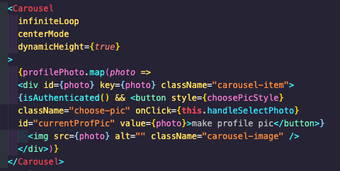
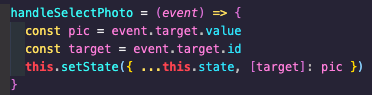

The profile edit page was a great example of pre-loading data using Axios requests. All of the user’s images (profile and recent) were preloaded in Cloudinary's preview panel, which is embedded into the code. I created individual delete buttons for each picture, so it was very easy for the user to delete and upload new pictures. 

We also had an 'Interests' part of the user’s profile. 
These were icons I had gotten from the internet depicting different interests someone may have when it comes to travel. E.g. rural roads, sea, forest, mountain roads, solo, history etc. These icons were simple pictures and hovering over them on a profile you would get a little box with its title, I did this using React-tool-tip. On the edit page the setup was slightly different. All the available icons were mapped out (after being sent for in the back end) with their titles underneath them. The ones the user had already selected had their titles in white and the rest in black. 

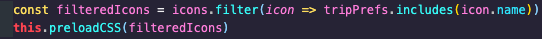
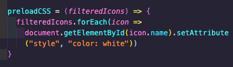

Changing interests was as easy as clicking the icon you want and clicking on the one you don’t want (if the title was white first).

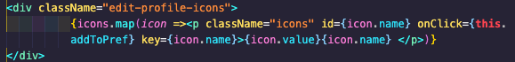

These icons and their value(title) were also used as tags for the trips themselves. This was great as on the index page where you can search for trips, they could then be filtered by these same interests.
On the profile we also have the conversations the user has open with other users, whether they have sent them or received them. 

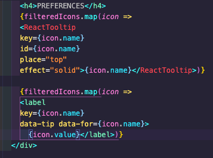

# Bugs:
After copious amounts of testing we seem to have ironed out all known kinks in our website. The only thing that would need amending is the carousel renders the images in a non-uniform way which from a UX perspective is quite shabby.

# Hurdles:
At first the icons gave me a lot of trouble as I thought it would be a good idea to use SVG as an absolute newb to the industry let alone anything more technical. After lots of head banging and wrestling matches, I then found a way round of still having the icons I wanted but in a much simpler way. It was a little bit quick and dirty as I screenshotted the icons I wanted and used them as a PNG image instead. As a beginner this was my go-to solution though after re-reading the SVG documentation I have a much better understanding of it.

# Wins:
My team’s dynamic was positive and productive. Our lack of git merge issues is a testament to that I believe. At no point did we have any feelings of being lost or chaotic among our work. Focused and humorous with each other we sailed through project week and it was a really great experience.

# Improvements
- At present the search function does not filter through both the search query and the tags selected which is a high desirable.
- I would like to refactor the messaging service we created to be a little pop up box in the corner of the screen rather than a separate page all together.
- An alert system when you receive a new message.

# Key Learnings
My team and I all quite naturally were extremely respectful of each other’s code, not touching that which we did not write without communicating first. I believe this to be an invaluable quality in group work and I attribute this to the pleasant and smooth production of this project from start to finish.
